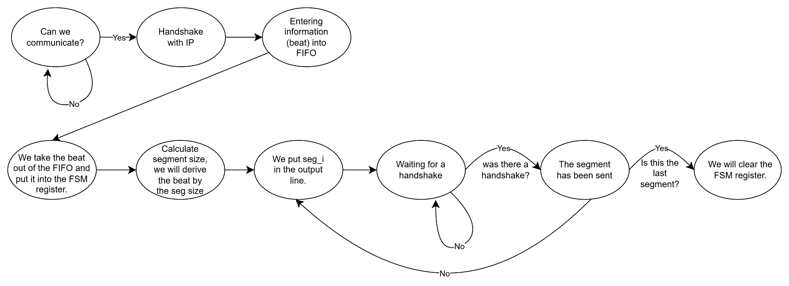

# axi_bridge_ip_tx — Design & Integration Specification (TX, IP-side)

## 1. Purpose and scope
`axi_bridge_ip_tx` is the TX-side IP bridge for a UCIe-based system. It accepts AXI-Stream traffic from an upstream IP (`s_axis_*`), buffers it in a synchronous FIFO, and serializes each accepted beat into Client-IF segments (`cl_tx_*`) with SOP/EOP framing. In parallel, it collects TX telemetry (frames/bytes/FIFO level/stall cycles) and emits 1-cycle error/event pulses.

**Current scope (implemented):**
- AXI-Stream ingress acceptance with backpressure and optional strict `tkeep` legality checking.
- Synchronous FIFO buffering of accepted beats.
- TX serializer block integration (behavior to be completed once serializer RTL is reviewed).
- Stats block integration.

**Out of scope (future layers):**
- UCIe Link-layer framing/CRC/replay/credits (unless/ until integrated above/below this block).


---


## 2. Block-level architecture
### 2.1 Dataflow
1) **Ingress (`axi_bridge_ip_tx_ingress`)**: Accept AXI-Stream beats, apply backpressure, validate `tkeep` (optional), pack FIFO entries, and generate byte-increment hints.

2) **FIFO (`fifo_sync`)**: Synchronous buffering and level reporting.

3) **Serializer (`axi_bridge_ip_tx_serializer`)**: Pop FIFO entries and serialize `DATA_W`→`IF_W` segments to Client-IF; generate SOP/EOP; generate stall/frame-done hooks.

4) **Stats (`axi_bridge_ip_tx_stats`)**: Accumulate counters and expose telemetry.

### 2.2 Clocking
All submodules operate in a **single clock domain** (`clk_i`) with a shared active-low reset (`rst_ni`). No CDC is assumed inside this block.

---

## 3. Parameterization and derived widths
### 3.1 Parameters
| Parameter | Default | Meaning |
|---|---:|---|
| `DATA_W` | 256 | AXI-Stream data width (bits) |
| `IF_W` | 64 | Client-IF segment width (bits) |
| `TUSER_W` | 16 | Sideband width (`tuser` / `cl_tx_user`) |
| `FIFO_DEPTH` | 16 | FIFO depth (entries) |

### 3.2 Derived values
| Name | Definition | Meaning |
|---|---|---|
| `BYTES_PER_BEAT` | `DATA_W/8` | Bytes per AXI beat |
| `ENTRY_W` | `DATA_W + (DATA_W/8) + TUSER_W + 1` | FIFO entry width |

### 3.3 Static constraints (design-time)
- `DATA_W % 8 == 0` and `IF_W % 8 == 0` (byte aligned).
- The current design assumes `IF_W <= DATA_W`.

---

## 4. Top-level interface
### 4.1 Clock/Reset
| Signal | Dir | Width | Description |
|---|---|---:|---|
| `clk_i` | In | 1 | System clock |
| `rst_ni` | In | 1 | Active-low reset |

### 4.2 AXI-Stream input (from IP)
| Signal | Dir | Width | Handshake | Description |
|---|---|---:|---|---|
| `s_axis_tdata` | In | `DATA_W` | TVALID/TREADY | Data payload |
| `s_axis_tkeep` | In | `DATA_W/8` | with beat | Per-byte valid mask |
| `s_axis_tuser` | In | `TUSER_W` | with beat | Sideband metadata |
| `s_axis_tvalid` | In | 1 | master→slave | Beat valid |
| `s_axis_tlast` | In | 1 | with beat | End-of-packet marker |
| `s_axis_tready` | Out | 1 | slave→master | Backpressure to upstream |

### 4.3 Client-IF TX output (to downstream)
| Signal | Dir | Width | Handshake | Description |
|---|---|---:|---|---|
| `cl_tx_data` | Out | `IF_W` | VALID/READY | Segment data |
| `cl_tx_keep` | Out | `IF_W/8` | with seg | Segment byte valid mask |
| `cl_tx_user` | Out | `TUSER_W` | with seg | Segment sideband |
| `cl_tx_valid` | Out | 1 | master→slave | Segment valid |
| `cl_tx_sop` | Out | 1 | with seg | Start-of-packet |
| `cl_tx_eop` | Out | 1 | with seg | End-of-packet |
| `cl_tx_ready` | In | 1 | slave→master | Downstream backpressure |

### 4.4 CSR controls
| Signal | Dir | Width | Description |
|---|---|---:|---|
| `bridge_enable` | In | 1 | Global enable for ingress/tx path |
| `strict_tkeep_en` | In | 1 | Enforce strict `tkeep` legality checks (ingress) |
| `tx_fifo_afull_thr` | In | 8 | FIFO almost-full threshold (ingress backpressure) |
| `drop_on_midreset` | In | 1 | Serializer policy for mid-reset / mid-disable drop/flush |

### 4.5 Telemetry outputs
| Signal | Dir | Width | Description |
|---|---|---:|---|
| `stat_tx_frames` | Out | 32 | Frame counter (incremented on `frame_done_pulse`) |
| `stat_tx_bytes` | Out | 32 | Byte counter (accumulated from ingress `bytes_inc`) |
| `stat_tx_fifo_level` | Out | 16 | Snapshot of FIFO occupancy |
| `stat_tx_stall_cycles` | Out | 32 | Count of downstream stall cycles |

### 4.6 Event/error pulses (1-cycle)
| Signal | Dir | Width | Fires when |
|---|---|---:|---|
| `ev_err_tkeep_illegal` | Out | 1 | Strict `tkeep` check fails on an **accepted** AXI beat |
| `ev_err_midreset_drop` | Out | 1 | Serializer drops/flushes due to midreset policy |
| `ev_err_overflow_tx` | Out | 1 | Overflow condition detected at ingress (see notes) |

---

## 5. FIFO entry format
Accepted AXI beats are packed into FIFO entries with the following bit layout:

```
{ tlast, tuser, tkeep, tdata }
```

Where:
- `tdata` width: `DATA_W`
- `tkeep` width: `DATA_W/8`
- `tuser` width: `TUSER_W`
- `tlast` width: 1

This packing is produced by `axi_bridge_ip_tx_ingress` and consumed by `axi_bridge_ip_tx_serializer`.

---

## 6. Submodule specifications

### 6.1 axi_bridge_ip_tx_ingress
**File:** `axi_bridge_ip_tx_ingress.sv`

#### 6.1.1 Responsibility
AXI-Stream slave-side ingress:
- Generates `s_axis_tready` based on `bridge_enable`, FIFO `full`, and an almost-full threshold.
- Accepts beats only on AXI handshake and pushes them into the FIFO.
- Optionally enforces strict `tkeep` legality.
- Emits 1-cycle event pulses (`tkeep_illegal`, `overflow_tx`).
- Computes per-beat byte count (`bytes_inc`) for stats.

#### 6.1.2 Dependencies (package)
Ingress imports `axi_bridge_ip_tx_pkg::*` and relies on:
- `MAX_KEEP_W`: maximum supported keep width.
- `popcount_keep_fixed(keep, nbytes)`: counts asserted keep bits over `[0 .. nbytes-1]`.
- `tkeep_illegal_f_fixed(keep, nbytes, is_last)`: enforces strict keep legality.

**Package configuration note:**
- `MAX_KEEP_W` is set to 256 bits (bytes lanes), meaning the package supports up to 256 bytes/beat.
- The inline comment in the package saying “512 bytes” is inconsistent with the actual value `256`; the effective support is **256 bytes**, i.e., `DATA_W` up to 2048 bits.

#### 6.1.3 Backpressure and acceptance
**Handshake definition:**
- `s_axis_handshake = s_axis_tvalid && s_axis_tready`

**Almost-full threshold:**
- A truncated threshold is derived by taking the low bits of `tx_fifo_afull_thr` to match `fifo_level` width.
- `fifo_almost_full = (fifo_level >= thr_trunc)`.

**Ready equation:**
- `s_axis_tready = bridge_enable && !fifo_full && !fifo_almost_full`.

**FIFO push condition:**
- `fifo_push = s_axis_handshake`.

#### 6.1.4 FIFO packing
On handshake, ingress pushes:
- `fifo_wdata = { s_axis_tlast, s_axis_tuser, s_axis_tkeep, s_axis_tdata }`.

#### 6.1.5 Byte increment generation
Ingress provides a per-beat byte increment for stats accumulation:
- Pads `s_axis_tkeep` into a fixed-width vector `keep_pad[MAX_KEEP_W-1:0]` where the **LSBs** are the actual keep bits.
- `bytes_inc = popcount_keep_fixed(keep_pad, BYTES_PER_BEAT)`.
- `bytes_inc_valid = s_axis_handshake`.

#### 6.1.6 Event pulses
All events are 1-cycle pulses, cleared to 0 by default each cycle.

- **Illegal `tkeep` event**
  - Fires only on an **accepted** beat:
    - condition: `s_axis_handshake && strict_tkeep_en && tkeep_illegal_f_fixed(keep_pad, BYTES_PER_BEAT, s_axis_tlast)`
  - output: `ev_err_tkeep_illegal_pulse = 1` for 1 cycle.

- **Overflow event**
  - condition: `fifo_push && fifo_full`
  - note: The RTL comments indicate this is **typically unreachable** because `fifo_push` implies `s_axis_tready` which implies `!fifo_full`; it is retained for compatibility/intent.
  - output: `ev_err_overflow_tx_pulse = 1` for 1 cycle.

#### 6.1.7 Strict TKEEP legality (axi_bridge_ip_tx_pkg)
When `strict_tkeep_en==1`, the ingress validates the beat `tkeep` using `tkeep_illegal_f_fixed()` from `axi_bridge_ip_tx_pkg`.

**Rules (evaluated on the active byte lanes `[0 .. nbytes-1]`):**
- **Non-last beats** (`tlast==0`): `tkeep` must be **all ones** for the beat (no gaps, no truncation).
- **Last beat** (`tlast==1`): `tkeep` must be **monotonic** of the form `1…10…0` (contiguous asserted bytes starting at byte 0, then zeros; no holes).

This strict rule set ensures that a beat’s *valid byte count* can be derived by `popcount` and that the last segment can be represented using only `last_seg_bytes` (without needing to preserve exact sparse byte positions).

#### 6.1.8 Notes / integration considerations
- **Threshold truncation:** If `tx_fifo_afull_thr` exceeds the representable range of `fifo_level`, the truncation can wrap/alias. Software should program `tx_fifo_afull_thr` within `[0 .. FIFO_DEPTH]`.
- **Strict legality definition:** The exact definition of “illegal” is determined by `tkeep_illegal_f_fixed()` in the package. This spec will be expanded once the package function definition is included in the documentation set.

---

### 6.2 fifo_sync
**File:** `fifo_sync.sv`

#### 6.2.1 Responsibility
Synchronous FIFO buffering between ingress and serializer:
- Stores `WIDTH`-wide entries (`WIDTH=ENTRY_W` in `axi_bridge_ip_tx`).
- Provides occupancy (`level_o`), `full`, and `empty`.
- Supports `clear_i` flush (e.g., `drop_on_midreset`).

#### 6.2.2 Interface and status signals
| Signal | Dir | Description |
|---|---|---|
| `push_i`, `wdata_i` | In | Push a new entry (guarded internally when full) |
| `pop_i` | In | Pop the current head entry (guarded internally when empty) |
| `rdata_o` | Out | Head entry data (show-ahead) |
| `full_o` | Out | Asserted when FIFO occupancy equals `DEPTH` |
| `empty_o` | Out | Asserted when FIFO occupancy is 0 |
| `level_o` | Out | Occupancy counter (`0..DEPTH`) |
| `clear_i` | In | Synchronous flush to empty the FIFO |

#### 6.2.3 Show-ahead read semantics
This FIFO is explicitly **show-ahead**:
- `rdata_o` is continuously driven as `mem[rd_ptr]`.
- When `empty_o==0`, `rdata_o` reflects the current head entry without requiring a pop.

This matches the assumption used by `axi_bridge_ip_tx_ser_beat_fetch`.

#### 6.2.4 Push/pop behavior
Internally, the FIFO guards the operations:
- `do_push = push_i && !full_o`
- `do_pop  = pop_i  && !empty_o`

A `unique case` over `{do_push, do_pop}` implements:
- **Push only:** write `wdata_i` at `wr_ptr`, increment `wr_ptr`, increment `count`.
- **Pop only:** increment `rd_ptr`, decrement `count`.
- **Push + pop:** write at `wr_ptr` and advance both pointers; `count` unchanged.

#### 6.2.5 Clear/reset behavior
- On `rst_ni==0`: pointers and occupancy are reset to 0.
- On `clear_i==1`: pointers and occupancy are reset to 0 (FIFO becomes empty).

**Note:** Memory contents are not explicitly cleared; after a clear, `empty_o==1` ensures consumers must not treat `rdata_o` as valid until a new push occurs.

#### 6.2.6 Integration notes
- Because `rdata_o` is combinationally driven from `mem[rd_ptr]`, synthesis may infer either a register array or a RAM with asynchronous read depending on target/library. If a true synchronous-read RAM is required, this FIFO will need to be adapted (and `beat_fetch` logic adjusted accordingly).

---

### 6.3 axi_bridge_ip_tx_serializer
**File:** `axi_bridge_ip_tx_serializer.sv`

#### 6.3.1 Responsibility
The serializer converts FIFO entries (each entry representing one accepted AXI beat) into one or more downstream Client-IF segments (`IF_W` wide). It also owns **mid-disable drop/flush policy** and provides **stats hooks** (frame done, stall cycles).

This module is a wrapper that coordinates two internal submodules:
- `axi_bridge_ip_tx_ser_beat_fetch` — fetches and buffers a FIFO entry, exposing a stable beat interface plus precomputed segmentation metadata.
- `axi_bridge_ip_tx_ser_segment_gen` — slices the buffered beat into segments, drives `cl_tx_*`, and generates completion/stall pulses.

#### 6.3.2 Wrapper-level mid-disable drop policy (implemented)
The wrapper detects a **falling edge** of `bridge_enable` and can force a flush/clear if there is pending activity.

**State:**
- `bridge_enable_q` = registered copy of `bridge_enable`.

**Pending activity definition:**
- `pending_activity = in_packet || beat_valid || cl_tx_valid_o || !fifo_empty_i`

**Drop/flush trigger (1-cycle pulse):**
If all conditions are met:
- `drop_on_midreset == 1`
- `bridge_enable_q == 1` and `bridge_enable == 0` (falling edge)
- `pending_activity == 1`

Then, for one cycle the wrapper asserts:
- `flush_pulse = 1` (to both submodules)
- `fifo_clear_o = 1` (flush FIFO)
- `ev_err_midreset_drop_pulse_o = 1`

**Implication:**
- The drop event is tied to a controlled enable transition (CSR-driven “mid-disable”). Reset (`rst_ni`) still resets state, but does not generate this event.

#### 6.3.3 Beat interface and precomputed segmentation metadata
The serializer wrapper exposes the FIFO entry as a beat-level interface toward `segment_gen`:
- `beat_valid` — indicates a beat with payload is available for segmentation.
- `beat_data[DATA_W-1:0]`, `beat_keep[DATA_W/8-1:0]`, `beat_user[TUSER_W-1:0]`, `beat_last` — unpacked fields from the FIFO entry.
- `beat_num_segs` — number of downstream segments required for this beat.
- `beat_last_seg_bytes` — valid byte count in the last segment (used for last-segment `keep`).

These are produced by `beat_fetch` and consumed by `segment_gen`.

#### 6.3.4 Client-IF message/segment composition (current implementation)
In the current code, the outbound Client-IF “message” consists of the following parallel signals per cycle:
- `cl_tx_data_o[IF_W-1:0]`
- `cl_tx_keep_o[IF_W/8-1:0]`
- `cl_tx_user_o[TUSER_W-1:0]`
- `cl_tx_valid_o`
- `cl_tx_sop_o` / `cl_tx_eop_o`

**Important:**
- This serializer **does not insert an explicit header** into `cl_tx_data_o` in the RTL you provided. It transmits **raw payload slices** of `beat_data` and conveys framing via SOP/EOP plus `cl_tx_user`.
- Additional “between-layers” fields you mentioned can be introduced later by augmenting `segment_gen` (e.g., preamble/header segments at SOP), or by a dedicated header/framing layer downstream. Once you add that logic, this section will be extended accordingly.

##### 6.3.4.1 Segment ordering and data slicing
- Data is transmitted **LSB-first** from the beat shift register:
  - First segment: `cl_tx_data_o = beat_data[IF_W-1:0]`
  - Next segments: the internal shift register shifts right by `IF_W` bits each accepted segment.
  - Therefore, segment *k* corresponds to `beat_data[(k+1)*IF_W-1 : k*IF_W]` (conceptually), for `k=0..num_segs-1`.

##### 6.3.4.2 KEEP generation
`cl_tx_keep_o` is generated from `beat_last_seg_bytes` and **does not currently use** `beat_keep_i` directly.
- For all non-last segments of a multi-segment beat: `keep = all 1s` (full segment).
- For the last segment of the beat:
  - If `last_seg_bytes == 0` or `last_seg_bytes == BYTES_PER_SEG` ⇒ `keep = all 1s`.
  - Else ⇒ `keep[b] = 1` for `b < last_seg_bytes`, `0` otherwise (LSB bytes first).

**Design note:** Because `beat_keep_i` is ignored in the current `segment_gen`, correctness relies on `beat_fetch` computing `valid_bytes` via popcount and, when `strict_tkeep_en` is used, on `tkeep` being “well-formed” (e.g., contiguous from byte 0). Sparse/holes in `tkeep` may produce mismatched semantics (bytes counted but not mapped to the exact byte positions). If sparse-keep support is required, `segment_gen` must be updated to slice `beat_keep_i` per segment.

##### 6.3.4.3 SOP/EOP rules and frame tracking
- `cl_tx_sop_o` is asserted on the **first segment of a frame**:
  - `sop = (!in_packet) && (seg_idx == 0)`
- `cl_tx_eop_o` is asserted on the **last segment** of a beat that is marked as last beat of the frame:
  - `eop = beat_last && (seg_idx == last_seg_idx(num_segs))`

The segment generator maintains `in_packet` state:
- On an accepted segment (`cl_tx_valid && cl_tx_ready`):
  - If `sop` fired ⇒ `in_packet` becomes 1.
  - If `eop` fired ⇒ `in_packet` becomes 0 (EOP wins if both).

##### 6.3.4.4 USER propagation
`cl_tx_user_o` is held **constant for the entire frame**:
- At the start of a new frame (`!in_packet`), `frame_user` is latched from `beat_user_i`.
- For all segments while `in_packet==1`, `cl_tx_user_o = frame_user`.

This means that if upstream changes `tuser` mid-packet, the serializer will **not** reflect that change on the wire (by design).

##### 6.3.4.5 Completion and stall hooks
A segment is considered accepted when:
- `fire = enable_i && cl_tx_valid_o && cl_tx_ready_i`

Hooks:
- `beat_done_pulse_o = fire && (seg_idx == last_seg_idx(num_segs))`
- `frame_done_pulse_o = fire && cl_tx_eop_o`
- `stall_cycle_en_o = enable_i && cl_tx_valid_o && !cl_tx_ready_i`

#### 6.3.5 Enable/flush behavior (segment generator)
- If `flush_i==1`: the segment generator drops local state immediately (`active=0`, `valid=0`, `seg_idx=0`, `in_packet=0`).
- If `enable_i==0`: it **pauses** transmission by deasserting `valid` while keeping internal state; when re-enabled, it resumes from the buffered beat/segment.

#### 6.3.6 Submodule: axi_bridge_ip_tx_ser_beat_fetch
**File:** `axi_bridge_ip_tx_ser_beat_fetch.sv`

**Role:** FIFO → buffered beat loader (assumes show-ahead FIFO).

**Unpack of FIFO entry (matches ingress packing):**
- `tdata = fifo_rdata_i[DATA_W-1:0]`
- `tkeep = fifo_rdata_i[DATA_W +: BYTES_PER_BEAT]`
- `tuser = fifo_rdata_i[DATA_W + BYTES_PER_BEAT +: TUSER_W]`
- `tlast = fifo_rdata_i[ENTRY_W-1]`

**Load/pop policy:**
- Can load a new beat when `enable_i && !fifo_empty_i` and either:
  - no buffered beat (`!beat_valid_o`), or
  - the current beat is being released this cycle.
- FIFO is advanced with a 1-cycle `fifo_pop_o` pulse when loading.

**Beat release policy:**
- `beat_ready_i` is edge-detected and treated as a release pulse on its rising edge.
- `beat_done_pulse_i` can also release the beat (legacy/optional).
- `beat_release_pulse = beat_done_pulse_i || rising_edge(beat_ready_i)`.

**Flush:**
- `flush_i` immediately drops `beat_valid_o` (discards any buffered beat).

**Precomputation (for segmentation):**
- Computes `valid_bytes = popcount(tkeep)` using a fixed-width padded helper.
- If `valid_bytes==0` ⇒ sets `num_segs=0`, `last_seg_bytes=0`, and outputs `beat_valid_o=0` (the FIFO entry is consumed but produces no segments).
- Else:
  - `num_segs = ceil(valid_bytes / BYTES_PER_SEG)`
  - `last_seg_bytes = valid_bytes - (num_segs-1)*BYTES_PER_SEG`

#### 6.3.7 Submodule: axi_bridge_ip_tx_ser_segment_gen
**File:** `axi_bridge_ip_tx_ser_segment_gen.sv`

**Role:** Buffered beat → Client-IF segment driver.

**Core behavior:**
- Maintains a data shift register loaded with `beat_data_i`.
- Drives segments under downstream backpressure; outputs remain stable while stalled.
- Shifts right by `IF_W` bits after each accepted segment.
- Generates SOP/EOP and completion/stall pulses as defined in Section 6.3.4.

**Frame user behavior:**
- Latches `frame_user` at SOP (start of a frame) and uses it for all segments until EOP completes.

#### 6.3.8 Open items
- Whether sparse `tkeep` patterns must be supported (currently not fully supported by `segment_gen`).
- Exact `tkeep_illegal_f_fixed()` legality definition (package) to formally guarantee assumptions needed by `segment_gen`.

---

### 6.4 axi_bridge_ip_tx_stats
**File:** `axi_bridge_ip_tx_stats.sv`

#### 6.4.1 Responsibility
The stats block accumulates TX telemetry for software/CSR visibility:
- **Bytes**: accumulated from ingress per accepted AXI beat.
- **Frames**: incremented on serializer `frame_done_pulse`.
- **Stall cycles**: incremented while downstream backpressure stalls an otherwise-valid segment.
- **FIFO level**: zero-extended snapshot of the FIFO occupancy.

#### 6.4.2 Counter update rules
All counters are synchronous to `clk_i` and reset to zero on `rst_ni=0`.

- `stat_tx_fifo_level`:
  - Updated every cycle as a zero-extended copy of `fifo_level_i` into 16 bits:
    - `stat_tx_fifo_level <= { {(16-$bits(fifo_level_i)){1'b0}}, fifo_level_i }`

- `stat_tx_bytes`:
  - If `bytes_inc_valid_i` is asserted, then:
    - `stat_tx_bytes <= stat_tx_bytes + bytes_inc_i`

- `stat_tx_frames`:
  - If `frame_done_pulse_i` is asserted, then:
    - `stat_tx_frames <= stat_tx_frames + 1`

- `stat_tx_stall_cycles`:
  - If `stall_cycle_en_i` is asserted, then:
    - `stat_tx_stall_cycles <= stat_tx_stall_cycles + 1`

#### 6.4.3 Notes
- Counters are **wrapping** (natural modulo-2^32 behavior) and do not saturate.
- `stat_tx_fifo_level` is a **snapshot** (not a high-water mark).
